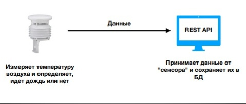
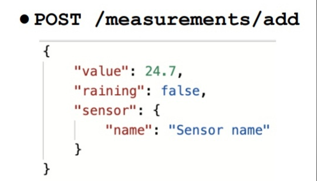

# REST API
## Задача
### Часть 1

1) Создание REST API приложения с помощью Spring REST 

2) Создание Java клиента, который бы отправлял данные на
REST API приложение - с помощью класса RestTemplate.

## Техническое задание
Описывается адрес API, данные которые передаются при запросе на
этот адрес и тот функционал, который должен предоставляться в
результате запроса на этот адрес

Регистрирует новый сенсор в системе. Другими словами, просто добавляет новый
сенсор в таблицу сенсоров в БД. Как видно из JSON'а - у сенсоров есть только одно
поле - название.
Вы должны помнить о правилах хорошего кода и использовать DTO для входящего
объекта - сенсора.
Также, вы должны валидировать то, что сенсора с таким названием еще нет в БД. Если сенсор с таким названием есть в БД - возвращать
клиенту сообщение с ошибкой.
Также, если название сенсора пустое или содержит менее 3 или более 30 символов, 
клиенту должно возвращаться сообщение с ошибкой.

Добавляет новое измерение. Это тот адрес, куда настоящий сенсор посылал бы свои данные. 
Вещественное поле "value" содержит значение температуры воздуха, булево поле "raining" содержит
значение true/false в зависимости от того, зарегистрировал ли сенсор дождь или нет. Помимо этого, в
этом запросе передается сам объект сенсора, который получил и отправляет эти "измерения".
Значения температуры воздуха, дождя должны сохранятся в таблице в БД. Также, в каждой строке этой
таблицы должно содержаться название того сенсора, который прислал эти измерения. То есть
сущность "Измерение" имеет связь с сущностью "Сенсор".
Все поля у измерения должны валидироваться.
Значение "value" должно быть не пустым и находиться в диапазоне от -100 до 100.
Значение "raining" должно быть не пустым.
Значение "sensor" должно быть не пустым. При этом, название сенсора должно валидироваться в БД. 
Сенсор с таким названием должен быть зарегистрирован в системе (должен быть в БД).
Если такого сенсора нет в БД - выдавать ошибку. Также, не забывайте про DTO.
На сервере, у измерения должно выставляться текущее время, оно должно сохраняться в БД.

Всего в приложении должно быть 4 адреса:
1) Регистрация сенсора

2) Добавление измерения от сенсора

3) Получение всех измерений

4) Получение количества дождливых дней

После того, как REST приложение будет готово, необходимо
перейти ко второй части задания и реализовать клиента.

## Часть 2
https://github.com/Blynchik/ClientREST/tree/master/src/main/java/org/example

Используйте класс RestTemplate, чтобы отправить 1000 запросов со
случайными температурами и "дождями" на адрес:

### POST /measurements/add

Не забудьте перед этим зарегистрировать новый сенсор (тоже с
помощью запроса).

После этого, используйте RestTemplate, чтобы получить эти 1000 
измерений с сервера, отправив GET запрос на адрес:

### /measurements

Задание со * (необязательное):
Постройте график температур, получив 1000 температур с сервера.
Для построения графика можно использовать библиотеку xchart

### Стэк: Spring Boot